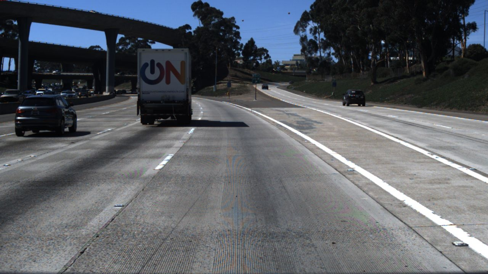
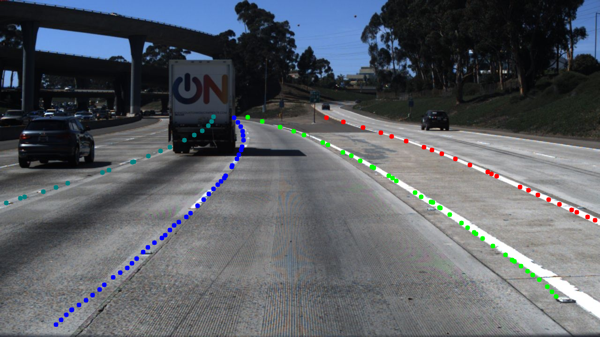
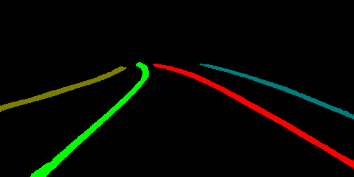

# LaneNet-Lane-Detection
Use tensorflow to implement a Deep Neural Network for real time lane detection mainly based on the IEEE IV conference 
paper "Towards End-to-End Lane Detection: an Instance Segmentation Approach".You can refer to their paper for details 
https://arxiv.org/abs/1802.05591. This model consists of a encoder-decoder stage, binary semantic segmentation stage 
and instance semantic segmentation using discriminative loss function for real time lane detection task.

The main network architecture is as follows:

`Network Architecture`


## Installation
This software has only been tested on ubuntu 16.04(x64), python3.5, cuda-9.0, cudnn-7.0 with a GTX-1070 GPU. 
To install this software you need tensorflow 1.12.0 and other version of tensorflow has not been tested but I think 
it will be able to work properly in tensorflow above version 1.12. Other required package you may install them by

```
pip3 install -r requirements.txt
```

## Test model
In this repo I uploaded a model trained on tusimple lane dataset [Tusimple_Lane_Detection](http://benchmark.tusimple.ai/#/).
The deep neural network inference part can achieve around a 50fps which is similar to the description in the paper. But
the input pipeline I implemented now need to be improved to achieve a real time lane detection system.

The trained lanenet model weights files are stored in 
[lanenet_pretrained_model](https://www.dropbox.com/sh/0b6r0ljqi76kyg9/AADedYWO3bnx4PhK1BmbJkJKa?dl=0). You can 
download the model and put them in folder model/tusimple_lanenet/

You can test a single image on the trained model as follows

```
python tools/test_lanenet.py --weights_path /PATH/TO/YOUR/CKPT_FILE_PATH 
--image_path ./data/tusimple_test_image/0.jpg
```
The results are as follows:

`Test Input Image`



`Test Lane Mask Image`



`Test Lane Binary Segmentation Image`


`Test Lane Instance Segmentation Image`



If you want to evaluate the model on the whole tusimple test dataset you may call
```
python tools/evaluate_lanenet_on_tusimple.py 
--image_dir ROOT_DIR/TUSIMPLE_DATASET/test_set/clips 
--weights_path /PATH/TO/YOUR/CKPT_FILE_PATH 
--save_dir ROOT_DIR/TUSIMPLE_DATASET/test_set/test_output
```
If you set the save_dir argument the result will be saved in that folder 
or the result will not be saved but be 
displayed during the inference process holding on 3 seconds per image. 
I test the model on the whole tusimple lane 
detection dataset and make it a video. You may catch a glimpse of it bellow.

`Tusimple test dataset gif`


## Train your own model
#### Data Preparation
Firstly you need to organize your training data refer to the data/training_data_example folder structure. And you need 
to generate a train.txt and a val.txt to record the data used for training the model. 

The training samples consist of three components, a binary segmentation label file, a instance segmentation label
file and the original image. The binary segmentation uses 255 to represent the lane field and 0 for the rest. The 
instance use different pixel value to represent different lane field and 0 for the rest.

All your training image will be scaled into the same scale according to the config file.

Use the script here to generate the tensorflow records file

```
python tools/make_tusimple_tfrecords.py 
```

#### Train model
In my experiment the training epochs are 80010, batch size is 4, initialized learning rate is 0.001 and use polynomial 
decay with power 0.9. About training parameters you can check the global_configuration/config.py for details. 
You can switch --net argument to change the base encoder stage. If you choose --net vgg then the vgg16 will be used as 
the base encoder stage and a pretrained parameters will be loaded. And you can modified the training 
script to load your own pretrained parameters or you can implement your own base encoder stage. 
You may call the following script to train your own model

```
python tools/train_lanenet_tusimple.py 
```

You may monitor the training process using tensorboard tools

During my experiment the `Total loss` drops as follows:  


The `Binary Segmentation loss` drops as follows:  


The `Instance Segmentation loss` drops as follows:  


## Experiment
The accuracy during training process rises as follows: 


Please cite my repo [lanenet-lane-detection](https://github.com/MaybeShewill-CV/lanenet-lane-detection) if you use it.

## Recently updates 2018.11.10
Adjust some basic cnn op according to the new tensorflow api. Use the 
traditional SGD optimizer to optimize the whole model instead of the
origin Adam optimizer used in the origin paper. I have found that the
SGD optimizer will lead to more stable training process and will not 
easily stuck into nan loss which may often happen when using the origin
code.

## Recently updates 2018.12.13
Since a lot of user want a automatic tools to generate the training samples
from the Tusimple Dataset. I upload the tools I use to generate the training
samples. You need to firstly download the Tusimple dataset and unzip the 
file to your local disk. Then run the following command to generate the 
training samples and the train.txt file.

```angular2html
python tools/generate_tusimple_dataset.py --src_dir path/to/your/unzipped/file
```

The script will make the train folder and the test folder. The training 
samples of origin rgb image, binary label image, instance label image will
be automatically generated in the training/gt_image, training/gt_binary_image,
training/gt_instance_image folder.You may check it yourself before start
the training process.

Pay attention that the script only process the training samples and you 
need to select several lines from the train.txt to generate your own 
val.txt file. In order to obtain the test images you can modify the 
script on your own.

## Recently updates 2020.06.12

Add real-time segmentation model BiseNetV2 as lanenet backbone. You may modify the
config/tusimple_lanenet.yaml config file to choose the front-end of lanenet model.

New lanenet model trainned based on BiseNetV2 can be found [here](https://www.dropbox.com/sh/0b6r0ljqi76kyg9/AADedYWO3bnx4PhK1BmbJkJKa?dl=0)

The new model can reach 78 fps in single image inference process.

## MNN Project

Add tools to convert lanenet tensorflow ckpt model into mnn model and deploy
the model on mobile device

#### Freeze your tensorflow ckpt model weights file
```
cd LANENET_PROJECT_ROOT_DIR
python mnn_project/freeze_lanenet_model.py -w lanenet.ckpt -s lanenet.pb
```

#### Convert pb model into mnn model
```
cd MNN_PROJECT_ROOT_DIR/tools/converter/build
./MNNConver -f TF --modelFile lanenet.pb --MNNModel lanenet.mnn --bizCode MNN
```

#### Add lanenet source code into MNN project 

Add lanenet source code into MNN project and modified CMakeList.txt to 
compile the executable binary file.

## TODO
- [x] Add a embedding visualization tools to visualize the embedding feature map
- [x] Add detailed explanation of training the components of lanenet separately.
- [x] Training the model on different dataset
- ~~[ ] Adjust the lanenet hnet model and merge the hnet model to the main lanenet model~~
- ~~[ ] Change the normalization function from BN to GN~~

## Acknowledgement

The lanenet project refers to the following projects:

- [MNN](https://github.com/alibaba/MNN)
- [SimpleDBSCAN](https://github.com/CallmeNezha/SimpleDBSCAN)
- [PaddleSeg](https://github.com/PaddlePaddle/PaddleSeg)

## Contact

Scan the following QR to disscuss :)

